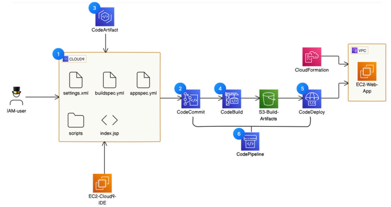

---

# AWS CI/CD Pipeline for Web Application Deployment

This project demonstrates a Continuous Integration and Continuous Deployment (CI/CD) pipeline setup on AWS for automating the development, build, and deployment of a web application to an EC2 instance. The pipeline integrates several AWS services to streamline the development process and enhance deployment efficiency.

## Project Overview

The CI/CD pipeline is built using the following AWS services:

1. **AWS Cloud9**: Used as an Integrated Development Environment (IDE) for writing, debugging, and running the source code.
2. **AWS CodeCommit**: A Git-based repository service that stores the application's source code.
3. **AWS CodeArtifact**: Manages and stores the necessary packages and dependencies required by the application.
4. **AWS CodeBuild**: Automates the process of building the source code and storing the build artifacts in an S3 bucket.
5. **AWS CodeDeploy**: Facilitates the automated deployment of the web application to the EC2 instance.
6. **AWS CodePipeline**: Manages and models the entire release process, from code building and deployment to testing and final release.

### Architecture



### Workflow

1. **Development (Cloud9)**: An IAM user writes and tests the code in the AWS Cloud9 environment. Code is managed with configuration files like `settings.xml`, `buildspec.yml`, and `appspec.yml` for build and deployment specifications.
2. **Source Control (CodeCommit)**: After writing code, changes are pushed to an AWS CodeCommit repository, which serves as the source of truth for the application code.
3. **Dependencies (CodeArtifact)**: CodeArtifact manages the necessary dependencies for the project, ensuring that builds are consistent.
4. **Build Process (CodeBuild)**: CodeBuild compiles the code and generates build artifacts, which are stored in an S3 bucket for further use in deployment.
5. **Deployment (CodeDeploy)**: CodeDeploy automates the deployment process to the EC2 instance within a VPC.
6. **Pipeline Management (CodePipeline)**: CodePipeline orchestrates the release process, including code build, testing, and deployment steps. It enables an automated, repeatable deployment cycle.

### Prerequisites

- AWS Account with permissions to use Cloud9, CodeCommit, CodeArtifact, CodeBuild, CodeDeploy, and CodePipeline.
- AWS CLI configured with appropriate IAM user permissions.
- EC2 instance configured to host the web application.

### Setup

1. Clone this repository to your Cloud9 environment:
    ```bash
    git clone <repository_url>
    ```
2. Push code changes to CodeCommit:
    ```bash
    git add .
    git commit -m "Initial commit"
    git push origin main
    ```
3. Configure `buildspec.yml` and `appspec.yml` based on your application requirements.
4. Set up AWS CodePipeline with the correct sequence of actions for CodeBuild, CodeDeploy, and other stages.

### Configuration Files

- **settings.xml**: Contains configurations for dependency management.
- **buildspec.yml**: Defines the build commands and environment settings for CodeBuild.
- **appspec.yml**: Contains instructions for CodeDeploy on how to deploy and start the application on the EC2 instance.

### Resources

- [AWS Cloud9 Documentation](https://docs.aws.amazon.com/cloud9/)
- [AWS CodeCommit Documentation](https://docs.aws.amazon.com/codecommit/)
- [AWS CodeArtifact Documentation](https://docs.aws.amazon.com/codeartifact/)
- [AWS CodeBuild Documentation](https://docs.aws.amazon.com/codebuild/)
- [AWS CodeDeploy Documentation](https://docs.aws.amazon.com/codedeploy/)
- [AWS CodePipeline Documentation](https://docs.aws.amazon.com/codepipeline/)

---
